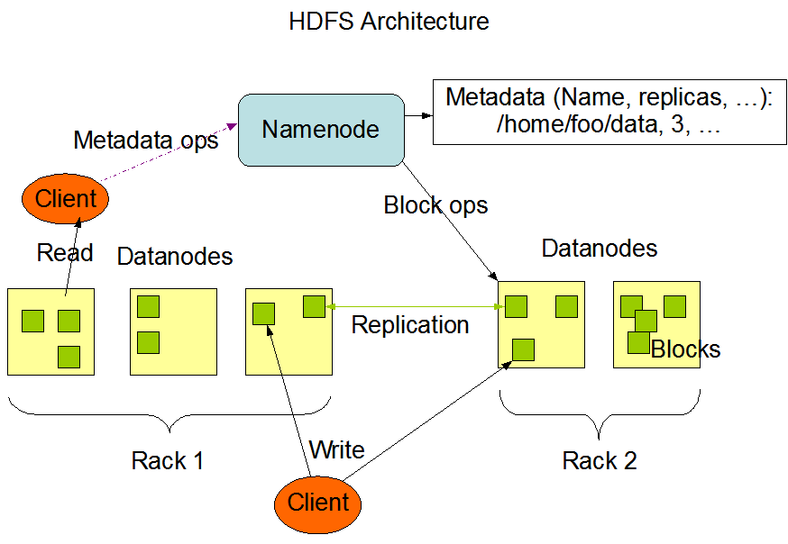
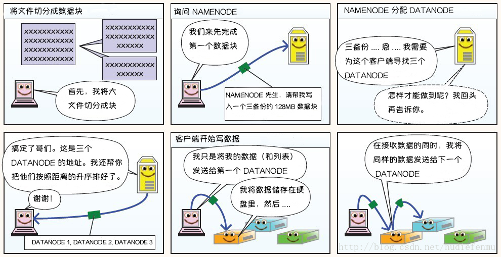

# HDFS

**Hadoop分布式文件系统（HDFS）是**运行在低成本商用硬件上的分布式文件系统，具有高度容错性，适用于批处理、大数据集（GB-TB）、write-once-read-many的场景。

## 1 概念

**机架（Rack）**：大型的HDFS实例通常分布在多个机架的多台服务器上，同个机架通常共享电源、网线和交换机，不同机架上的两台服务器之间通过交换机进行通讯，同一机架中的服务器间的网络带宽大于不同机架中的服务器之间的带宽，具体部署如图所示：

**命名空间（Namespace）**：描述文件系统组织和层次结构的名词。

**块（Block）**：HDFS文件被分割成数据块，作为独立单元存储。除了最后一个数据块，其他数据块的大小一样，默认128M。注意，小于单个数据块的文件不会占用整个数据块的底层存储空间，比一个文件只有1M，被分为1块，占用1M，而非128M。

**名称节点（NameNode，NN）**：master节点，一是管理文件系统namespace，维护文件系统树、文件属性和数据块与文件的映射关系，管理客户端对文件的访问，如打开、关闭、重命名文件或目录，这些元数据信息会被持久化到本地磁盘（FsImage和EditLog）；二是知道数据块与DataNode的映射关系、数据块存储的服务器，这部分信息不会持久化，而是在系统启动时构建。

**数据节点（DataNode，DN）**：worker节点，处理客户端的读写请求，根据NameNode的指示处理数据块创建、删除、复制，并周期性地向NameNode发送Blockreport，告诉NameNode存储其上的数据块。

**块报告（Blockreport）**：由DataNode发送给NameNode的信息，包含了DataNode上存储的数据块列表及其对应的本地文件。

**块缓存（Block Caching）**：对于经常访问的文件，数据块会被缓存在DataNode的内存中。缓存数据块可以增加读性能，比如那些小表维表用来做join的，就可以缓存起来。

**二级名称节点（Secondary NameNode，SNN）**：作为NameNode的B角存在，始终保留namespace映像的副本，但是由于周期性地合并editLog，可能与NameNode维护的最新的namespace存在lag，所以如果NameNode挂掉，Secondary NameNode顶上，可能会存在数据丢失的情况。

**HDFS高可用（HDFS HA）**：设置双NameNode，一个是active状态，一个是standby状态。若Active节点失败，Standby节点提升为Active节点继续提供服务。

**HDFS联邦机制（HDFS Federation）**：允许集群横向扩展NameNode避免内存不足。Namespace被拆分成了多个独立的部分，分别由不同的NameNode独立管理。DataNode作为共享存储，存储所有的数据块。

## 2 架构设计

### 2.1 主从架构

HDFS采用主从设计。一个HDFS集群由一个NameNode和多个DataNode组成，NameNode为master节点，DataNode为worker节点。

HDFS作为一个文件系统提供给用户存放数据。文件只允许write-once，且任何时候只允许一个写入。文件被分为一个或多个数据块存放在一组DataNode上。

任何支持跑Java应用的机器都可以部署NameNode和DataNode软件。一种典型的部署方案是，使用一台专用机器跑NameNode，只负责处理HDFS元数据，用户数据不流经NameNode；集群中的其他每台机器都跑一个DataNode实例。

### 2.2 文件系统Namespace

HDFS支持传统的层次型文件组织，

- 可以创建、移除、移动、重命名文件
- 支持用户配额，可以为单个目录设置名称配额和空间容量配额
- 支持访问权限
- 不支持硬链接或软连接
- 存在保留路径或名称
- NameNode负责维护文件系统名称空间，记录对名称空间或其属性的任何更改

### 2.3 数据复制

HDFS实现容错的方式之一是复制数据块，复制因子可以按文件粒度进行配置，默认情况下，复制因子是3。

NameNode决定数据块的复制，并周期型接收来自DataNode的心跳和Blockreport，Blockreport包含DataNode的块列表。

HDFS采用机架感知副本放置策略，对于常见情况，当复制因子为3时，HDFS的放置策略是：在写入程序位于DataNode上时，就优先将写入文件的一个副本放置在该DataNode上，否则放在随机DataNode上。之后在另一个远程机架上的任意一个节点上放置另一个副本，并在该机架上的另一个节点上放置最后一个副本。此策略可以减少机架间的写入流量，从而提高写入性能。

如果复制因子大于 3，则随机确定第 4 个和之后副本的放置位置，同时保持每个机架的副本数量低于上限，上限值通常为 `(复制因子 - 1) / 机架数量 + 2`，需要注意的是不允许同一个DataNode上具有同一个块的多个副本。

另外，集群启动时NameNode先进入安全模式。该模式下数据块不复制，NameNode接受DataNode的心跳和Blockreport，形成blockMap，并校验数据块是否达到了指定的副本数。校验之后，NameNode推出安全模式。如果发现数据块少于指定的副本数，NameNode复制它们到其他DataNode。

### 2.3 元数据持久化

NameNode使用事务日志EditLog记录增删改操作日志，如创建文件、修改副本数。EditLog存储在NameNode所在的OS文件系统。

NameNode使用FsImage记录文件系统namespace，如块与文件的映射关系、文件系统配置。FsImage也存放在NameNode所在的OS文件系统。FSImage 是 NameNode 自上次 checkpoint 之后生成的元数据，并不是实时的数据。

NameNode使用内存保留文件系统的映像和blockMap。

DataNode在本地文件系统存储HDFS数据，对HDFS文件无感知，只存储数据块到单独的文件里。

#### 2.3.1 Checkpoint

HDFS 的每个事务操作都会写入EditLog 中，随着时间的积累 EditLog 会变的很大，极端情况下会占满整个磁盘。另外，由于 NameNode 在启动的时候，需要将 EditLog 中的操作重新执行一遍，过大的 EditLog 会延长 NameNode 的启动时间。同时，实时更新FsImage效率比较低。所以，通过 Checkpoint 定期对元数据进行合并。

Checkpoint 会把 FSImage 和 EditLog 的内容进行合并生成一个新的 FSImage。

这样在 NameNode 启动的时候就不用将巨大的 EditLog 中的事务再执行一遍，而是直接加载合并之后的新 FSImage ，然后重新执行未被合并的 EditLog 文件就可以了。

#### 2.3.2 SNN辅助管理

### 2.4 通信协议

### 2.5 **架构的稳定性**

**1. 心跳机制和重新复制**

每个 DataNode 定期向 NameNode 发送心跳消息，如果超过指定时间没有收到心跳消息，则将DataNode 标记为死亡。NameNode 不会将任何新的 IO 请求转发给标记为死亡的 DataNode，也不会再使用这些DataNode 上的数据。 由于数据不再可用，可能会导致某些块的复制因子小于其指定值，NameNode会跟踪这些块，并在必要的时候进行重新复制。

**2. 数据的完整性**

由于存储设备故障等原因，存储在 DataNode 上的数据块也会发生损坏。为了避免读取到已经损坏的数据而导致错误，HDFS 提供了数据完整性校验机制来保证数据的完整性，具体操作如下：当客户端创建 HDFS 文件时，它会计算文件的每个块的 校验和，并将 校验和 存储在同一 HDFS 命名空间下的单独的隐藏文件中。当客户端检索文件内容时，它会验证从每个 DataNode 接收的数据是否与存储在关联校验和文件中的 校验和 匹配。如果匹配失败，则证明数据已经损坏，此时客户端会选择从其他 DataNode 获取该块的其他可用副本。

**3. 元数据的磁盘故障**

FsImage 和 EditLog 是 HDFS 的核心数据，这些数据的意外丢失可能会导致整个 HDFS 服务不可用。为了避免这个问题，可以配置 NameNode 使其支持 FsImage 和 EditLog 多副本同步，这样 FsImage 或 EditLog 的任何改变都会引起每个副本 FsImage 和 EditLog 的同步更新。

**4. 支持快照**

快照支持在特定时刻存储数据副本，在数据意外损坏时，可以通过回滚操作恢复到健康的数据状态。

## 3 **图解HDFS存储原理**

## 4 HDFS高可用

典型的HA集群中，2个或更多的独立机器配置为NameNode，但在任意一个时间点，只有一个NameNode处于Active状态，其他处于Standby状态。Active NameNode负责所有客户端操作，Standby NameNode只负责数据的同步，在必要时提供快速故障转移。

为了保证Standby节点状态与Active节点同步，要求节点可以访问共享存储设备上的目录。Active节点持续将namespace的修改写入共享目录的EditLog，Standby节点监控共享目录，一旦有编辑，就会应用到自己的namespace。当故障转移发生时，StandBy节点必须读取了所有变更，才能提升为Active节点。

此外，StandBy节点实时更新集群中的block位置，才能提供快速的故障转移。因为，所有的DataNode都知道所有NameNode的地址，并且发送block位置信息和心跳给所有NameNode。

脑裂：存在两个Active状态的NameNode，集群被分成了更小的集群。

当有两个NameNode时，提供哪个NameNode地址给客户端？Hadoop提供了NameService进程，其是NameNode的代理，维护NameNode列表并存储NameNode的状态，客户端直接访问的是NameService，NameService会将请求转发给当前状态为Active的NameNode。

## 参考资料

HDFS Architecture Guide. https://hadoop.apache.org/docs/r1.2.1/hdfs_design.html, 2022-07-31

Hadoop: The Definitive Guide. https://grut-computing.com/HadoopBook.pdf, 2022-07-31

翻译经典 HDFS 原理讲解漫画. https://blog.csdn.net/hudiefenmu/article/details/37655491, 2022-07-31

Hadoop分布式文件系统——HDFS. https://github.com/heibaiying/BigData-Notes/blob/master/notes/Hadoop-HDFS.md, 2022-07-31

Hadoop高可用集群. https://zhuanlan.zhihu.com/p/49556561, 2022-08-10